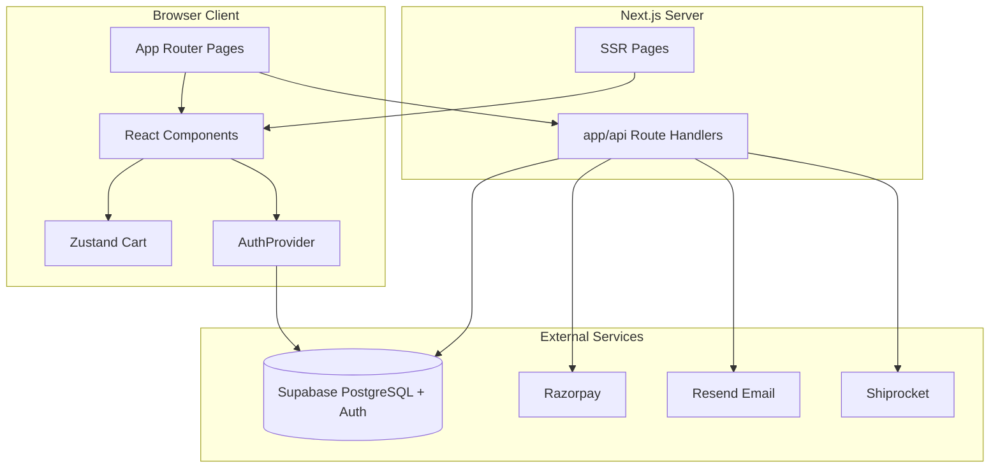
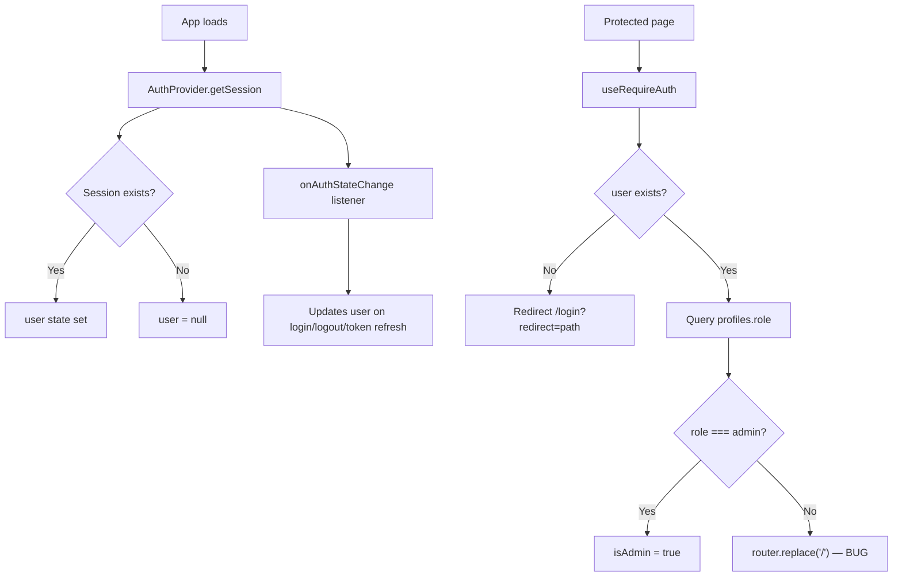

# Herbixe — Complete Interview Preparation Analysis

> Code-backed technical reference for all 76 project files. Every claim is grounded in actual source code.

---

## 1. Complete Project Architecture

### 1.1 High-Level Architecture

Herbixe is a **monolithic full-stack Next.js 14 application**. The frontend (React pages/components) and backend (API Route Handlers under `app/api/`) live in one repository and deploy as a single unit to Vercel. Data persists in **Supabase PostgreSQL** with **Supabase Auth** for JWT sessions. External services handle payments (Razorpay), email (Resend), and shipping (Shiprocket).



### 1.2 Folder Structure and Purpose

| Folder | Purpose | Layer |
|--------|---------|-------|
| `app/` | Next.js App Router: pages, layouts, loading UI, global CSS | Frontend + Backend |
| `app/api/` | REST API Route Handlers (13 routes) | **Backend** |
| `app/admin/` | Admin dashboard UI (orders, stats) | Frontend |
| `app/account/` | Customer profile and addresses | Frontend |
| `app/checkout/` | Checkout form + payment success | Frontend |
| `app/products/` | Product listing and detail pages | Frontend |
| `app/login/`, `app/signup/` | Authentication pages (bare layout) | Frontend |
| `app/hair-quiz/` | Product recommendation quiz | Frontend |
| `app/track-order/` | Guest order lookup | Frontend |
| Static pages | `our-story`, `sustainability`, `contact`, `terms`, `privacy`, `refund`, `returns` | Frontend |
| `components/sections/` | Homepage marketing sections | Frontend UI |
| `components/layout/` | Navbar, Footer, shell wrapper | Frontend UI |
| `components/ui/` | ProductCard, CartDrawer, CustomCursor | Frontend UI |
| `components/three/` | React Three Fiber 3D hero | Frontend UI |
| `components/providers/` | AuthProvider React context | Shared (client) |
| `store/` | Zustand cart state | Shared (client state) |
| `lib/` | Supabase, Razorpay, email, Shiprocket, auth guards, static products | Backend + shared utilities |
| `types/` | Hand-written TypeScript interfaces | Shared |
| `database/` | PostgreSQL schema SQL | Database |
| Root config | `package.json`, `next.config.js`, `tsconfig.json`, etc. | Configuration |

### 1.3 Complete File Inventory (All 76 Files)

#### Root Configuration (8 files)

| File | Layer | Purpose | When Executed |
|------|-------|---------|---------------|
| `package.json` | Config | Dependencies and npm scripts (`dev`, `build`, `start`, `lint`) | npm install / build |
| `package-lock.json` | Config | Locked dependency versions | npm install |
| `next.config.js` | Config | Allows remote images from `*.supabase.co` | Build time |
| `tsconfig.json` | Config | TypeScript strict mode, `@/*` path alias | Compile time |
| `tailwind.config.ts` | Config | Brand color palette, fonts, animations | Build time (Tailwind) |
| `postcss.config.js` | Config | Tailwind + autoprefixer pipeline | Build time |
| `.eslintrc.json` | Config | Extends `next/core-web-vitals` | Lint |
| `.gitignore` | Config | Ignores `.env*`, `node_modules`, `.next`, `.vercel` | Git |
| `next-env.d.ts` | Config | Next.js TypeScript declarations (auto-generated) | Compile time |
| `README.md` | Docs | Setup, structure, payment flow, deployment | Reference only |

#### `app/` — Pages and Layouts (28 files)

| File | Layer | Purpose | Interactions | When Executed |
|------|-------|---------|--------------|---------------|
| `app/layout.tsx` | Frontend | Root layout: metadata, Google Fonts, `AuthProvider`, `ConditionalSiteShell` | Wraps all pages | Every request (SSR shell) |
| `app/page.tsx` | Frontend | Homepage composing 8 marketing sections + CTA | Imports section components | SSR on `/` |
| `app/loading.tsx` | Frontend | Global loading fallback UI | Next.js automatic | During route transitions |
| `app/globals.css` | Frontend | Tailwind layers + custom component classes (`.btn-gold`, `.panel`, etc.) | Imported by layout | Every page |
| `app/login/page.tsx` | Frontend | Sign-in form via `useAuth().signIn`, redirect param | `AuthProvider`, Supabase Auth | Client hydration |
| `app/signup/page.tsx` | Frontend | Sign-up form via `useAuth().signUp` | `AuthProvider`, `/api/signup/welcome` | Client hydration |
| `app/checkout/page.tsx` | Frontend | Delivery form + Razorpay payment | `useRequireAuth`, `useCartStore`, `/api/razorpay/*`, Supabase prefill | Client hydration |
| `app/checkout/success/page.tsx` | Frontend | Post-payment confirmation | Reads `payment_id` query param | Client hydration |
| `app/account/page.tsx` | Frontend | Profile edit + order history | `GET/PATCH /api/account` | Client hydration |
| `app/account/addresses/page.tsx` | Frontend | Saved addresses CRUD | `/api/account/addresses` | Client hydration |
| `app/products/page.tsx` | Frontend | Product catalog with category filter | `filterByCategory()` from `lib/products.ts` | SSR |
| `app/products/[slug]/page.tsx` | Frontend | Product detail page (SSG) | `getProductBySlug()`, renders `ProductDetailClient` | Build time + SSR |
| `app/products/[slug]/ProductDetailClient.tsx` | Frontend | Client-side add-to-cart, qty selector | `useCartStore` | Client hydration |
| `app/hair-quiz/page.tsx` | Frontend | Multi-step quiz → product recommendations | `lib/products.ts`, `useCartStore` | Client hydration |
| `app/track-order/page.tsx` | Frontend | Guest order lookup by email | `GET /api/orders`, `GET /api/shiprocket/track` | Client hydration |
| `app/admin/layout.tsx` | Frontend | Admin sidebar + access gate | `useRequireAuth().isAdmin` | Client hydration |
| `app/admin/page.tsx` | Frontend | Dashboard stats cards | `GET /api/admin/stats` | Client hydration |
| `app/admin/orders/page.tsx` | Frontend | Paginated order list with status filter | `GET /api/admin/orders` | Client hydration |
| `app/admin/orders/[id]/page.tsx` | Frontend | Order detail, status update, Shiprocket create | `GET/PATCH /api/admin/orders/[id]`, `POST /api/shiprocket/create` | Client hydration |
| `app/our-story/page.tsx` | Frontend | Brand story static content | `ContentPage` wrapper | SSR |
| `app/sustainability/page.tsx` | Frontend | Sustainability content | `ContentPage` | SSR |
| `app/contact/page.tsx` | Frontend | Contact info (no form) | `ContentPage` | SSR |
| `app/terms/page.tsx` | Frontend | Terms of service | `ContentPage` | SSR |
| `app/privacy/page.tsx` | Frontend | Privacy policy | `ContentPage` | SSR |
| `app/refund/page.tsx` | Frontend | Refund policy | `ContentPage` | SSR |
| `app/returns/page.tsx` | Frontend | Returns policy | `ContentPage` | SSR |

#### `app/api/` — Backend Route Handlers (13 files)

| File | Layer | Purpose | Interactions | When Executed |
|------|-------|---------|--------------|---------------|
| `app/api/products/route.ts` | Backend | GET products from DB or static fallback | `supabaseAdmin()`, `lib/products.ts` | HTTP GET request |
| `app/api/orders/route.ts` | Backend | GET orders by email; POST manual order insert | `supabaseAdmin()`, `orders` table | HTTP request |
| `app/api/account/route.ts` | Backend | GET/PATCH customer profile + orders | Bearer JWT, `customers`, `addresses`, `orders` | HTTP request |
| `app/api/account/addresses/route.ts` | Backend | POST/DELETE addresses | Bearer JWT, `addresses` table | HTTP request |
| `app/api/signup/route.ts` | Backend | Server-side signup with admin API | `auth.admin.createUser`, `customers`, Resend | HTTP POST |
| `app/api/signup/welcome/route.ts` | Backend | Post-client-signup customer row + welcome email | `auth.admin.listUsers`, `customers`, Resend | HTTP POST |
| `app/api/razorpay/create/route.ts` | Backend | Create Razorpay order + pending DB row | Razorpay SDK, `orders` insert | HTTP POST |
| `app/api/razorpay/verify/route.ts` | Backend | HMAC verify + mark paid + confirmation email | `verifySignature()`, `orders` update, Resend | HTTP POST |
| `app/api/admin/stats/route.ts` | Backend | Dashboard statistics | `getAdminUserId()`, `orders` aggregations | HTTP GET |
| `app/api/admin/orders/route.ts` | Backend | Paginated order list | `getAdminUserId()`, `orders` | HTTP GET |
| `app/api/admin/orders/[id]/route.ts` | Backend | Order detail + status update + emails | `getAdminUserId()`, Resend | HTTP GET/PATCH |
| `app/api/shiprocket/create/route.ts` | Backend | Create Shiprocket shipment | `getAdminUserId()`, `lib/shiprocket.ts` | HTTP POST |
| `app/api/shiprocket/track/route.ts` | Backend | Track shipment by AWB or order ID | `lib/shiprocket.ts` | HTTP GET |

#### `components/` (17 files)

| File | Layer | Purpose | Interactions | When Executed |
|------|-------|---------|--------------|---------------|
| `components/providers/AuthProvider.tsx` | Shared | Supabase session context: `user`, `signIn`, `signUp`, `signOut` | `lib/supabase.ts`, `/api/signup/welcome` | Client — app mount |
| `components/layout/ConditionalSiteShell.tsx` | Frontend | Bare layout for login/signup; full chrome elsewhere | Navbar, Footer, CartDrawer | Client — every page |
| `components/layout/Navbar.tsx` | Frontend | Navigation, cart toggle, auth links | `useAuth`, `useCartStore` | Client |
| `components/layout/Footer.tsx` | Frontend | Site footer with links | Static links | Client |
| `components/layout/ContentPage.tsx` | Frontend | Reusable wrapper for policy/content pages | Used by static pages | SSR |
| `components/ui/ProductCard.tsx` | Frontend | Product grid card with add-to-cart | `useCartStore`, Link to PDP | Client |
| `components/ui/CartDrawer.tsx` | Frontend | Slide-out cart panel | `useCartStore`, checkout redirect | Client |
| `components/ui/CustomCursor.tsx` | Frontend | Custom cursor on fine-pointer devices | DOM events | Client |
| `components/sections/HeroSection.tsx` | Frontend | Hero with lazy-loaded 3D scene | `HeroScene` | SSR + client |
| `components/sections/MarqueeBand.tsx` | Frontend | Scrolling brand marquee | Static content | SSR |
| `components/sections/PhilosophySection.tsx` | Frontend | Brand philosophy section | Framer Motion | SSR + client |
| `components/sections/ProductsSection.tsx` | Frontend | Featured products on homepage | `ProductCard`, `getFeaturedProducts()` | SSR |
| `components/sections/FeaturedProduct.tsx` | Frontend | Highlighted product with add-to-cart | `useCartStore` | Client |
| `components/sections/IngredientsSection.tsx` | Frontend | Ingredients showcase section | Framer Motion | SSR + client |
| `components/sections/ProcessSection.tsx` | Frontend | Process/how-it-works section | Exported from `IngredientsSection.tsx` | SSR + client |
| `components/sections/TestimonialsSection.tsx` | Frontend | Customer testimonials | Exported from `IngredientsSection.tsx` | SSR + client |
| `components/three/HeroScene.tsx` | Frontend | R3F 3D crystal ball scene | `@react-three/fiber`, `@react-three/drei` | Client only (no SSR) |

#### `lib/` (7 files)

| File | Layer | Purpose | Interactions | When Executed |
|------|-------|---------|--------------|---------------|
| `lib/supabase.ts` | Backend + Shared | Browser anon client + server `supabaseAdmin()` | All DB/auth operations | Import time / API calls |
| `lib/requireAuth.ts` | Shared (client hook) | Auth guard: redirect unauthenticated users, check admin role | `AuthProvider`, `profiles` table | Client — protected pages |
| `lib/requireAdmin.ts` | Backend | Server admin check via Bearer JWT + `profiles.role` | All admin API routes | HTTP request |
| `lib/razorpay.ts` | Backend + Shared | Razorpay SDK, HMAC verify, script loader, paise conversion | Payment routes, checkout page | Server / client |
| `lib/email.ts` | Backend | Resend transactional emails (4 templates) | Verify route, admin routes, signup | Server — API calls |
| `lib/shiprocket.ts` | Backend | Shiprocket REST client with token cache | Shiprocket API routes | Server — API calls |
| `lib/products.ts` | Shared | Static product seed data + helper functions | Product pages, API fallback | Import time |

#### `store/`, `types/`, `database/` (3 files)

| File | Layer | Purpose |
|------|-------|---------|
| `store/cartStore.ts` | Shared (client) | Zustand cart with localStorage persist (`herbixe-cart`) |
| `types/index.ts` | Shared | TypeScript interfaces: `Product`, `Order`, `CartItem`, `ApiResponse`, etc. |
| `database/schema.sql` | Database | Full PostgreSQL schema: 5 tables, RLS, triggers, seed data |

### 1.4 Responsibility Matrix

| Concern | Files |
|---------|-------|
| **Frontend UI** | All `app/*/page.tsx` (except API), all `components/` |
| **Backend / API** | All `app/api/**/route.ts`, `lib/requireAdmin.ts`, `lib/email.ts`, `lib/shiprocket.ts`, `lib/razorpay.ts` (server parts) |
| **Shared utilities** | `lib/supabase.ts`, `lib/products.ts`, `types/index.ts`, `store/cartStore.ts`, `lib/requireAuth.ts` |
| **Business logic** | Shipping rule (≥₹999 free) in `razorpay/create`, payment verify in `lib/razorpay.ts`, order lifecycle in admin routes |
| **Authentication** | `AuthProvider.tsx`, `requireAuth.ts`, `requireAdmin.ts`, `app/api/signup/*`, Supabase Auth |
| **Database operations** | All API routes via `supabaseAdmin()`; direct browser reads in checkout for address prefill |
| **Configuration** | Root config files; env vars referenced in `lib/` files |
| **Environment variables** | Not committed. Referenced in: `lib/supabase.ts`, `lib/razorpay.ts`, `lib/email.ts`, `lib/shiprocket.ts`. README references missing `.env.local.example`. |

### 1.5 Critical Code Issues (Know These for Interviews)

1. **`profiles` vs `customers` mismatch**: Admin auth queries `profiles.role` but schema defines roles on `customers.role`.
2. **`useRequireAuth` bug**: Non-admin authenticated users are redirected to `/`, breaking `/checkout` and `/account`.
3. **`/api/products` unused by frontend**: Pages read from static `lib/products.ts` instead.

---

## 2. Complete Tech Stack

| Technology | Version | Category | Why Chosen | Problem It Solves |
|------------|---------|----------|------------|-------------------|
| **Next.js** | 14.2.3 | Framework | App Router, SSR, API routes in one deploy | Full-stack in single repo |
| **React** | 18 | Frontend | Component-based UI | Interactive pages |
| **TypeScript** | 5 | Language | Type safety | Catch errors at compile time |
| **Tailwind CSS** | 3.4.1 | Styling | Utility-first, fast iteration | Brand design system |
| **Supabase JS** | 2.43.0 | Auth + Database | Managed Postgres + Auth + RLS | Backend without custom server |
| **Zustand** | 4.5.2 | State management | Lightweight, persist middleware | Cart across page navigations |
| **Razorpay** | 2.9.6 | Payments | Standard Indian payment gateway | UPI, cards, netbanking |
| **Resend** | 3.2.0 | Email | Simple transactional email API | Order/shipping/welcome emails |
| **Shiprocket** | REST API | Shipping | Indian fulfillment platform | Order creation + tracking |
| **Framer Motion** | 11.2.0 | Animations | Declarative React animations | Section transitions |
| **React Three Fiber** | 8.16.0 | 3D | React renderer for Three.js | Hero 3D scene |
| **@react-three/drei** | 9.105.0 | 3D helpers | Pre-built R3F utilities | 3D scene helpers |
| **Three.js** | 0.164.1 | 3D engine | WebGL 3D rendering | Crystal ball hero |
| **npm** | — | Package manager | Default Node ecosystem | Dependency management |
| **Vercel** | — | Deployment | Documented target; zero-config Next.js | Hosting frontend + API |
| **ESLint** | 8 | Tooling | Code quality | Lint via `next lint` |
| **Google Fonts** | CDN | Typography | Cormorant Garamond + Jost | Premium brand typography |
| **PostCSS + Autoprefixer** | 10/8 | Tooling | CSS processing pipeline | Tailwind compilation |

**Not present:** Redux, React Query/SWR, Prisma, Next.js middleware, Docker, CI/CD, test frameworks, generated Supabase types.

---

## 3. Frontend-Backend Workflows

### 3.1 Signup Flow

```
User fills signup form (app/signup/page.tsx)
  → AuthProvider.signUp(email, password, name)
  → supabase.auth.signUp() with user_metadata.full_name
  → Fire-and-forget POST /api/signup/welcome { email, name }
      → supabaseAdmin().auth.admin.listUsers() — find user by email
      → UPSERT into customers table (role='customer')
      → sendWelcomeEmail() via Resend
  → UI shows "check your email" confirmation screen
```

**Alternate path:** `POST /api/signup` creates user server-side via `auth.admin.createUser` — not used by current frontend.

### 3.2 Login Flow

```
User fills login form (app/login/page.tsx)
  → AuthProvider.signIn(email, password)
  → supabase.auth.signInWithPassword()
  → onAuthStateChange updates user in context
  → router.replace(redirect param, default /checkout)
```

Login/signup use **bare layout** (no Navbar/Footer/CartDrawer) via `ConditionalSiteShell`.

### 3.3 Browse Products Flow

```
User visits /products or homepage sections
  → Server component imports filterByCategory() / getFeaturedProducts()
  → Data from lib/products.ts (static array, NOT /api/products)
  → ProductCard renders with Link to /products/[slug]
  → PDP: getProductBySlug() in app/products/[slug]/page.tsx
```

**Note:** `/api/products` exists and queries Supabase with static fallback, but **no frontend page calls it**.

### 3.4 Add to Cart Flow

```
User clicks "Add to Cart" (ProductCard, FeaturedProduct, ProductDetailClient, hair-quiz)
  → useCartStore.addItem(product)
  → Zustand updates items array
  → persist middleware saves to localStorage key 'herbixe-cart'
  → CartDrawer reflects updated items (no server call)
```

### 3.5 Checkout + Payment Flow

```
User opens CartDrawer → "Begin the Ritual — Checkout"
  → If not logged in: /login?redirect=/checkout
  → /checkout page: useRequireAuth() + useCartHydrated()
  → Prefill form from user metadata, addresses table, customers.phone
  → User clicks "Pay with Razorpay"
      1. loadRazorpayScript() — inject checkout.js
      2. POST /api/razorpay/create
         Body: { items: CartItem[], customer: form fields }
         Headers: Authorization: Bearer {access_token}
         Server: calculate subtotal/shipping/total
         Server: rzp.orders.create() via Razorpay SDK
         Server: INSERT orders (status='pending', JSONB customer/items)
         Response: { data: { orderId, amount, currency, keyId } }
      3. new Razorpay({ key, amount, order_id, handler }).open()
      4. User pays in Razorpay modal
      5. handler callback → POST /api/razorpay/verify
         Body: { razorpay_order_id, razorpay_payment_id, razorpay_signature }
         Server: verifySignature() HMAC-SHA256
         Server: UPDATE orders SET status='paid', razorpay_payment_id, paid_at
         Server: sendOrderConfirmation() via Resend
      6. clearCart() → router.push('/checkout/success?payment_id=...')
```

**Shipping rule:** Free if subtotal ≥ ₹999, else ₹60 (computed in both checkout UI and create API).

### 3.6 Account Management Flow

```
/account page
  → useRequireAuth()
  → GET /api/account (Bearer token)
      → Validates JWT via Supabase anon client + auth header
      → supabaseAdmin() fetches customers, addresses, orders by user_id
  → PATCH /api/account { name, phone } — upserts customers row
/account/addresses
  → POST /api/account/addresses — insert address (clears other defaults if is_default)
  → DELETE /api/account/addresses?id=xxx — scoped to customer_id
```

### 3.7 Guest Order Tracking Flow

```
/track-order page
  → User enters email
  → GET /api/orders?email=user@example.com (NO AUTH)
      → supabaseAdmin() queries orders WHERE customer->>'email' = email
  → Optional: GET /api/shiprocket/track?order_id=xxx for live tracking
```

### 3.8 Admin Order Management Flow

```
/admin (requires isAdmin from useRequireAuth)
  → GET /api/admin/stats (Bearer + getAdminUserId checks profiles.role)
  → Dashboard: total orders, revenue, status breakdown, recent 5
/admin/orders
  → GET /api/admin/orders?status=&page=&limit=
/admin/orders/[id]
  → GET single order
  → PATCH { status, shiprocket_order_id, tracking_id }
      → Sets shipped_at/delivered_at timestamps
      → Sends shipping/delivery emails via Resend
  → POST /api/shiprocket/create { order_id, pickup_location }
      → Builds Shiprocket payload from order JSONB
      → Updates order: shiprocket_order_id, status='processing'
```

---

## 4. How This Project Was Built From Scratch

| Step | Task | Why This Order |
|------|------|----------------|
| 1 | `npx create-next-app` with TypeScript + App Router | Foundation |
| 2 | Install dependencies (Tailwind, Supabase, Zustand, Razorpay, Framer Motion, R3F) | Before writing features |
| 3 | Configure Tailwind (`tailwind.config.ts`) + `globals.css` design tokens | Visual system before components |
| 4 | Run `database/schema.sql` in Supabase SQL Editor | Database before any data operations |
| 5 | Create `lib/supabase.ts` (browser + admin clients) | Auth and DB access layer |
| 6 | Define `types/index.ts` + `lib/products.ts` static seed | Types and fallback data |
| 7 | Build root `layout.tsx` + `AuthProvider` + `ConditionalSiteShell` | App shell before pages |
| 8 | Build homepage sections + product pages | Core storefront |
| 9 | Add Zustand `cartStore.ts` + `CartDrawer` + `Navbar` | Shopping cart UX |
| 10 | Auth pages (login/signup) + signup API routes | Users before checkout |
| 11 | Checkout page + Razorpay create/verify APIs | Payment flow |
| 12 | Account pages + account API routes | Post-purchase experience |
| 13 | Admin panel + admin APIs + Shiprocket integration | Operations |
| 14 | Email templates (Resend) + deploy to Vercel with env vars | Production notifications |

---

## 5. Project Workflow (End to End)

```
1. Visitor opens https://herbixe.com
2. Root layout loads: fonts, AuthProvider initializes session, ConditionalSiteShell renders Navbar + Footer
3. Homepage SSR renders marketing sections (Hero with 3D, products preview, testimonials)
4. User browses /products — static product data filtered by category
5. User adds items to cart — Zustand persists to localStorage
6. User opens CartDrawer, clicks Checkout
7. If unauthenticated → /login?redirect=/checkout → sign in → redirect back
8. Checkout page prefills form from profile/addresses
9. User clicks Pay → Razorpay modal → payment succeeds
10. Server verifies HMAC signature → order status = 'paid' → confirmation email sent
11. Cart cleared → /checkout/success shown
12. User views orders in /account (authenticated) or /track-order (guest, by email)
13. Admin sees new order in /admin/orders
14. Admin creates Shiprocket shipment → order status = 'processing'
15. Admin marks shipped → shipping email sent
16. Admin marks delivered → delivery email sent
```

---

## 6. Languages Used

| Language | Where Used | Why Needed |
|----------|------------|------------|
| **TypeScript** | All `.ts` and `.tsx` files (~60 files) | Type-safe full-stack development |
| **SQL (PostgreSQL)** | `database/schema.sql` | Table definitions, RLS policies, seed data |
| **PL/pgSQL** | Trigger functions in schema (`update_updated_at`, `refresh_product_rating`) | Auto-update timestamps and product ratings |
| **CSS** | `app/globals.css` | Tailwind directives + custom component classes |
| **JSON** | `package.json`, API request/response bodies, JSONB columns in orders | Configuration and data interchange |
| **JSX/TSX** | React components | UI markup in TypeScript |
| **HTML** | Email templates in `lib/email.ts` | Transactional email content |
| **JavaScript** | `next.config.js`, `postcss.config.js` (CommonJS config files) | Build tooling configuration |

---

## 7. APIs

### 7.1 Internal API Routes

#### `GET /api/products`
- **Auth:** None
- **Query params:** `category`, `active`
- **Response:** `{ data: Product[], source: 'db' | 'static' }`
- **Handler:** [`app/api/products/route.ts`](app/api/products/route.ts)

#### `GET /api/orders?email=`
- **Auth:** None (security gap)
- **Response:** `{ data: Order[] }` or `{ error: string }`
- **Handler:** [`app/api/orders/route.ts`](app/api/orders/route.ts)

#### `POST /api/orders`
- **Auth:** None (security gap)
- **Body:** Full order object
- **Response:** `{ data: Order }` (201) or `{ error: string }`

#### `GET /api/account`
- **Auth:** Bearer JWT required
- **Response:** `{ data: { profile, addresses, orders } }`

#### `PATCH /api/account`
- **Auth:** Bearer JWT required
- **Body:** `{ name?, phone? }`
- **Response:** `{ data: { success: true } }`

#### `POST /api/account/addresses`
- **Auth:** Bearer JWT required
- **Body:** `{ line1, line2?, city, state, pincode, country?, is_default? }`
- **Response:** `{ data: Address }` (201)

#### `DELETE /api/account/addresses?id=`
- **Auth:** Bearer JWT required
- **Response:** `{ data: { success: true } }`

#### `POST /api/signup`
- **Auth:** None
- **Body:** `{ email, password, name }`
- **Response:** `{ data: { user_id } }` or `{ error: string }`

#### `POST /api/signup/welcome`
- **Auth:** None
- **Body:** `{ email, name }`
- **Response:** `{ ok: true }` (always succeeds to not block signup)

#### `POST /api/razorpay/create`
- **Auth:** Optional Bearer (links user_id to order)
- **Body:** `{ items: CartItem[], customer: CustomerInfo }`
- **Response:** `{ data: { orderId, amount, currency, keyId } }`

#### `POST /api/razorpay/verify`
- **Auth:** HMAC signature (not Bearer)
- **Body:** `{ razorpay_order_id, razorpay_payment_id, razorpay_signature }`
- **Response:** `{ data: { success: true, paymentId } }` or `{ error: string }`

#### `GET /api/admin/stats`
- **Auth:** Admin Bearer (profiles.role in admin/staff)
- **Response:** `{ data: { totalOrders, totalRevenue, paidOrderCount, statusCounts, recentOrders } }`

#### `GET /api/admin/orders?status=&page=&limit=`
- **Auth:** Admin Bearer
- **Response:** `{ data: { orders, total, page, limit } }`

#### `GET /api/admin/orders/[id]`
- **Auth:** Admin Bearer
- **Response:** `{ data: Order }`

#### `PATCH /api/admin/orders/[id]`
- **Auth:** Admin Bearer
- **Body:** `{ status?, shiprocket_order_id?, tracking_id? }`
- **Response:** `{ data: Order }`

#### `POST /api/shiprocket/create`
- **Auth:** Admin Bearer
- **Body:** `{ order_id, pickup_location? }`
- **Response:** `{ data: ShiprocketResult }`

#### `GET /api/shiprocket/track?awb=` or `?order_id=`
- **Auth:** None
- **Response:** `{ data: trackingResult }`

### 7.2 External APIs

| Service | Endpoints Used | Purpose |
|---------|----------------|---------|
| Supabase Auth | `signUp`, `signInWithPassword`, `getSession`, `getUser`, `admin.createUser`, `admin.listUsers` | Authentication |
| Supabase PostgreSQL | `.from().select/insert/update/delete()` | Data persistence |
| Razorpay | `orders.create`, `checkout.razorpay.com/v1/checkout.js` | Payment processing |
| Resend | `resend.emails.send()` | Transactional email |
| Shiprocket | `/auth/login`, `/orders/create/adhoc`, `/courier/track/*` | Fulfillment + tracking |
| Google Fonts | CSS import in layout | Typography |

### 7.3 Error Handling Pattern

All API routes follow a consistent pattern:
```typescript
try {
  // logic
  return NextResponse.json({ data: ... })
} catch (err) {
  console.error('...', err)
  return NextResponse.json({ error: '...' }, { status: 500 })
}
```

Frontend reads `{ data?, error? }` from JSON responses and displays errors in local `useState`.

---

## 8. Database Design

### 8.1 Entity Relationship Diagram

```mermaid
erDiagram
  auth_users ||--o| customers : "extends via id"
  customers ||--o{ addresses : has
  auth_users ||--o{ orders : places
  products ||--o{ reviews : receives
  auth_users ||--o{ reviews : writes
  orders ||--o{ reviews : verifies

  products {
    uuid id PK
    text slug UK
    text category
    integer price
    boolean is_active
    numeric rating
    integer review_count
  }

  customers {
    uuid id PK_FK
    text name
    text phone
    text role
  }

  addresses {
    uuid id PK
    uuid customer_id FK
    text line1
    text city
    text pincode
    boolean is_default
  }

  orders {
    uuid id PK
    uuid user_id FK
    text razorpay_order_id UK
    text status
    integer total
    jsonb customer
    jsonb items
    text shiprocket_order_id
  }

  reviews {
    uuid id PK
    uuid product_id FK
    uuid user_id FK
    uuid order_id FK
    integer rating
    boolean approved
  }
```

### 8.2 Table Details

**products** — Catalog items with slug, category enum, pricing in rupees, arrays for ingredients/benefits/images, stock tracking, rating aggregates.

**customers** — Extends `auth.users` with name, phone, role (`customer|admin|staff|support`). Primary key = auth user ID.

**addresses** — Shipping addresses linked to customers. Supports default address flag.

**orders** — Order records with Razorpay IDs, status lifecycle, JSONB snapshots of customer info and line items at purchase time.

**reviews** — Product reviews with approval workflow. Trigger `refresh_product_rating` updates `products.rating` and `review_count`.

### 8.3 Row Level Security

- **products:** Public read when `is_active = true`
- **orders:** Users see own orders (`auth.uid() = user_id`); admins/staff see all
- **customers:** Users manage own row
- **addresses:** Users manage own rows
- **reviews:** Public read when `approved = true`; users insert own reviews

### 8.4 Data Flow

```
Signup → auth.users created → customers row inserted
Checkout → orders row inserted (pending) with JSONB snapshots
Payment verify → orders.status updated to 'paid'
Admin ship → shiprocket_order_id stored, status='processing'/'shipped'
Review (NOT IMPLEMENTED) → would insert reviews → trigger updates products.rating
```

### 8.5 Not Implemented

The `reviews` table, RLS policies, and rating trigger exist in schema but **no API routes or UI** allow users to submit reviews.

---

## 9. Authentication Flow

### 9.1 Session Management



### 9.2 File Responsibilities

| Step | File | What It Does |
|------|------|--------------|
| Session init | `components/providers/AuthProvider.tsx` | `getSession()` + `onAuthStateChange` |
| Client login | `AuthProvider.signIn` | `supabase.auth.signInWithPassword` |
| Client signup | `AuthProvider.signUp` | `supabase.auth.signUp` + welcome API |
| Client logout | `AuthProvider.signOut` | `supabase.auth.signOut` |
| Client route guard | `lib/requireAuth.ts` | Redirect if no user; check admin role |
| Server admin guard | `lib/requireAdmin.ts` | `getAdminUserId()` validates Bearer JWT + profiles.role |
| Server user guard | Account/razorpay routes | Create Supabase client with Bearer header, call `auth.getUser()` |
| Customer row creation | `app/api/signup/welcome/route.ts` | Upsert into `customers` after signup |
| Admin UI gate | `app/admin/layout.tsx` | Shows "Access Denied" if `!isAdmin` |

### 9.3 No Middleware

There is **no `middleware.ts`**. Route protection is entirely:
- Client-side redirects via `useRequireAuth()`
- Per-handler Bearer token validation in API routes

This means protected pages can be briefly rendered before redirect, and API routes without auth checks are fully accessible.

### 9.4 Known Bugs

1. **`profiles` vs `customers`:** Admin checks query `profiles` table not defined in `schema.sql`. Roles are on `customers.role`.
2. **`useRequireAuth` redirect:** Lines 36-40 redirect all non-admin users to `/`, blocking regular customers from `/checkout` and `/account`.

---

## 10. Production Readiness

### Verdict: **Development Stage / MVP — Not Production Ready**

The project has a complete feature set for a small e-commerce MVP (catalog, cart, checkout, admin, shipping, email) but has security gaps, auth bugs, and missing operational infrastructure.

### What's Missing

| Category | Gap | Evidence |
|----------|-----|----------|
| **Security** | Unauthenticated order lookup by email | `GET /api/orders?email=` |
| **Security** | Unauthenticated order insert | `POST /api/orders` |
| **Security** | Auth guard bug blocks customers | `lib/requireAuth.ts` |
| **Security** | Schema/code mismatch for admin | `profiles` vs `customers` |
| **Security** | Client-sent prices trusted at checkout | `razorpay/create` uses `i.product.price` from request body |
| **Security** | No rate limiting on public endpoints | signup, track, orders |
| **Security** | No Next.js middleware | Client-only protection |
| **Testing** | Zero tests | No test files or test runner |
| **CI/CD** | No automation | No `.github/workflows/` |
| **Monitoring** | console.error only | No Sentry/Datadog |
| **Validation** | Manual checks only | No Zod/Yup schema validation |
| **Env management** | Missing `.env.local.example` | README references non-existent file |
| **Stock management** | No inventory decrement | Orders don't update `products.stock` |
| **Reviews** | DB ready, feature not built | No API or UI |
| **Documentation** | README stale | Roadmap items partially implemented |
| **Performance** | No caching layer | Every API hits DB directly |
| **Image optimization** | Empty product images arrays | `next/image` configured but unused |

---

## 11. Software Architecture

### Architectures That Apply

| Architecture | Evidence | Why |
|--------------|----------|-----|
| **Monolithic Full-Stack** | Single Next.js repo deploys pages + API together | One deployable unit on Vercel |
| **Client-Server** | Browser React app ↔ API Route Handlers ↔ Supabase | Classic request/response |
| **Component-Based** | React component tree with composition | Homepage = composed sections |
| **Feature-Based Folders** | `app/admin/`, `app/checkout/`, `app/account/` | Routes grouped by feature |

### Architectures NOT Used

| Architecture | Why Not |
|--------------|---------|
| **Microservices** | Everything in one Next.js app |
| **MVC** | No separate Model/View/Controller layers; queries inline in route handlers |
| **Clean Architecture** | No domain/service/repository separation |
| **Repository Pattern** | Direct Supabase `.from()` calls everywhere |
| **BFF (separate)** | API routes are part of same Next.js app, not a separate backend |

---

## 12. Design Patterns

| Pattern | Where | Files | Why |
|---------|-------|-------|-----|
| **Provider Pattern** | Auth context wraps entire app | `AuthProvider.tsx` | Share session state without prop drilling |
| **Custom Hooks** | Auth guard, cart hydration | `requireAuth.ts`, `useCartHydrated()` in `cartStore.ts` | Reusable client logic |
| **Composition** | Homepage sections, ConditionalSiteShell | `app/page.tsx`, `ConditionalSiteShell.tsx` | Build pages from smaller pieces |
| **Singleton (lazy)** | Razorpay SDK instance | `getRazorpayInstance()` in `razorpay.ts` | One SDK instance per server process |
| **Strategy (implicit)** | DB products vs static fallback | `app/api/products/route.ts` | Graceful degradation when DB empty |
| **Persist Middleware** | Cart survives page reload | Zustand `persist` in `cartStore.ts` | UX: cart not lost on refresh |
| **Adapter** | Shiprocket REST wrapper | `lib/shiprocket.ts` | Abstract external API behind typed functions |
| **Snapshot Pattern** | Order JSONB at purchase time | `orders.customer`, `orders.items` | Preserve price/product info even if catalog changes |
| **Token Cache** | Shiprocket auth token | `cachedToken` in `shiprocket.ts` | Avoid re-authenticating every request |
| **Fire-and-Forget** | Welcome email after signup | `AuthProvider.signUp` → fetch with `.catch(() => {})` | Don't block signup on email failure |

---

## 13. Building Another Project Using This Stack

### Step-by-Step Blueprint

1. **Initialize:** `npx create-next-app@14 my-app --typescript --app --tailwind`
2. **Install core deps:** `@supabase/supabase-js`, `zustand`, domain-specific SDKs
3. **Folder structure:**
   ```
   app/           → pages + api/
   components/    → ui/, layout/, sections/, providers/
   lib/           → supabase.ts, domain utilities
   store/         → zustand stores
   types/         → shared interfaces
   database/      → schema.sql
   ```
4. **Database:** Write `schema.sql` with tables + RLS → run in Supabase SQL Editor
5. **Supabase clients:** Browser anon client + server `supabaseAdmin()` with service role
6. **Auth:** `AuthProvider` context + login/signup pages + signup API for customer row
7. **Layout:** Root layout with provider + conditional shell (bare auth pages)
8. **Feature pages:** Build UI consuming static seed data first, then wire to DB
9. **Client state:** Zustand with persist for cart/session UI state
10. **API routes:** Route handlers with Bearer JWT validation pattern from account routes
11. **Admin:** Separate `requireAdmin.ts` guard + admin layout with role check
12. **Payments:** Create → verify flow with server-side signature validation
13. **External services:** Wrap in `lib/` adapter modules (email, shipping)
14. **Deploy:** Vercel with all env vars in dashboard; Supabase hosted separately

### Key Conventions to Replicate

- Bearer JWT passed from client: `Authorization: Bearer ${session.access_token}`
- Server validates user: create Supabase client with anon key + auth header → `getUser()`
- Privileged DB writes: always via `supabaseAdmin()` service role
- API response shape: `{ data?: T, error?: string }`
- Form styling: shared CSS classes in `globals.css`

---

## 14. Interview Preparation — Questions and Answers

### Beginner (10 questions)

**Q1: What framework does Herbixe use and why?**
**A:** Next.js 14 with App Router (`package.json`). It provides SSR for product pages, file-based routing, and API Route Handlers in the same project — ideal for a full-stack e-commerce MVP without a separate backend server.
**Files:** `package.json`, `app/layout.tsx`

**Q2: How is the shopping cart managed?**
**A:** Zustand store with persist middleware. Cart items are stored in localStorage under key `herbixe-cart`. Actions include `addItem`, `removeItem`, `updateQty`, `clearCart`. A `useCartHydrated()` hook prevents SSR hydration mismatches.
**Files:** `store/cartStore.ts`

**Q3: Where does product data come from?**
**A:** Frontend pages import directly from `lib/products.ts` — a static TypeScript array. The `/api/products` route can also fetch from Supabase with this array as fallback, but frontend pages don't call that API.
**Files:** `lib/products.ts`, `app/products/page.tsx`

**Q4: What styling approach is used?**
**A:** Tailwind CSS 3.4 with a custom brand palette defined in `tailwind.config.ts` (cream, bark, moss, gold, sage). Global component classes like `.btn-gold`, `.panel`, `.form-input` are in `globals.css`. No CSS modules.
**Files:** `tailwind.config.ts`, `app/globals.css`

**Q5: How does the homepage render?**
**A:** `app/page.tsx` is a Server Component that composes 8 section components (HeroSection, MarqueeBand, PhilosophySection, etc.) plus a CTA banner. The hero includes a lazy-loaded 3D scene via React Three Fiber.
**Files:** `app/page.tsx`, `components/sections/HeroSection.tsx`

**Q6: What database does the project use?**
**A:** Supabase, which is managed PostgreSQL. Schema is defined in `database/schema.sql` with 5 tables: products, customers, addresses, orders, reviews. Row Level Security is enabled on all tables.
**Files:** `database/schema.sql`, `lib/supabase.ts`

**Q7: How does a user sign up?**
**A:** Client calls `AuthProvider.signUp()` which uses `supabase.auth.signUp()`. After success, a fire-and-forget POST to `/api/signup/welcome` creates a `customers` row and sends a welcome email via Resend.
**Files:** `components/providers/AuthProvider.tsx`, `app/api/signup/welcome/route.ts`

**Q8: What happens when a user is not logged in and tries to checkout?**
**A:** CartDrawer redirects to `/login?redirect=/checkout`. After login, the user is redirected back to checkout via the redirect query parameter.
**Files:** `components/ui/CartDrawer.tsx`, `app/login/page.tsx`

**Q9: What is ConditionalSiteShell?**
**A:** A client component that checks the pathname. For `/login` and `/signup`, it renders children without Navbar/Footer/CartDrawer. All other pages get the full site chrome.
**Files:** `components/layout/ConditionalSiteShell.tsx`

**Q10: What payment gateway is integrated?**
**A:** Razorpay. Server creates orders via SDK, client opens checkout modal, server verifies HMAC-SHA256 signature on payment success.
**Files:** `lib/razorpay.ts`, `app/api/razorpay/create/route.ts`, `app/api/razorpay/verify/route.ts`

### Intermediate (12 questions)

**Q11: Walk through the complete Razorpay payment flow.**
**A:** (1) Checkout page calls `loadRazorpayScript()`. (2) POST `/api/razorpay/create` with cart items and customer form — server calculates totals, creates Razorpay order, inserts pending DB row. (3) Client opens Razorpay modal with returned `orderId` and `keyId`. (4) On payment, handler POSTs to `/api/razorpay/verify` with signature. (5) Server runs `verifySignature()` HMAC check, updates order to `paid`, sends confirmation email. (6) Client clears cart and redirects to success page.
**Files:** `app/checkout/page.tsx`, `app/api/razorpay/create/route.ts`, `app/api/razorpay/verify/route.ts`, `lib/razorpay.ts`

**Q12: How does admin authorization work on the server?**
**A:** `getAdminUserId()` in `requireAdmin.ts` extracts Bearer token, creates Supabase client with that token, validates user via `auth.getUser()`, then queries `profiles.role` checking for `admin` or `staff`. Returns user ID or null (403).
**Files:** `lib/requireAdmin.ts`

**Q13: Explain the Supabase client setup.**
**A:** Two clients in `lib/supabase.ts`: (1) `supabase` — browser client with anon key for auth and direct reads. (2) `supabaseAdmin()` — server-only service role client that bypasses RLS, throws if called in browser.
**Files:** `lib/supabase.ts`

**Q14: How are orders stored in the database?**
**A:** The `orders` table uses JSONB columns for `customer` (name, email, phone, address snapshot) and `items` (product_id, product_name, price, qty). This snapshot pattern preserves purchase-time data even if products change later.
**Files:** `database/schema.sql`, `app/api/razorpay/create/route.ts`

**Q15: How does the admin update order status?**
**A:** Admin PATCHes `/api/admin/orders/[id]` with new status. Server sets `shipped_at` or `delivered_at` timestamps and triggers shipping/delivery emails via Resend.
**Files:** `app/api/admin/orders/[id]/route.ts`, `lib/email.ts`

**Q16: How does Shiprocket integration work?**
**A:** `lib/shiprocket.ts` authenticates with cached token (~9 days). Admin POSTs `/api/shiprocket/create` with order_id. Server builds payload from order JSONB, calls Shiprocket API, stores `shiprocket_order_id`, sets status to `processing`. Tracking via `/api/shiprocket/track`.
**Files:** `lib/shiprocket.ts`, `app/api/shiprocket/create/route.ts`

**Q17: What is the shipping cost logic?**
**A:** Free shipping if subtotal ≥ ₹999, otherwise ₹60. Computed in both the checkout UI (`app/checkout/page.tsx` line 19) and server-side in `razorpay/create` (line 11).
**Files:** `app/checkout/page.tsx`, `app/api/razorpay/create/route.ts`

**Q18: How does the hair quiz recommend products?**
**A:** Client-side quiz in `app/hair-quiz/page.tsx` scores user answers and maps to product categories/concerns, then displays matching products from `lib/products.ts` with add-to-cart buttons.
**Files:** `app/hair-quiz/page.tsx`, `lib/products.ts`

**Q19: Explain Row Level Security in this project.**
**A:** RLS enabled on all 5 tables. Products publicly readable when active. Orders visible to owner or admin/staff. Customers and addresses scoped to `auth.uid()`. Reviews publicly readable when approved. Service role bypasses RLS for API route writes.
**Files:** `database/schema.sql` (lines 128-162)

**Q20: How does the `/api/products` fallback strategy work?**
**A:** Route tries Supabase query first. If DB returns empty or errors, falls back to static `PRODUCTS` array from `lib/products.ts`. Response includes `source: 'db' | 'static'`.
**Files:** `app/api/products/route.ts`

**Q21: What email notifications are sent?**
**A:** Four templates in `lib/email.ts`: order confirmation (on payment verify), shipping notification (admin marks shipped), delivery confirmation (admin marks delivered), welcome email (on signup). All via Resend with branded HTML.
**Files:** `lib/email.ts`

**Q22: How does address management work?**
**A:** Authenticated users POST new addresses to `/api/account/addresses`. If `is_default=true`, other defaults are cleared first. DELETE removes by ID scoped to user's customer_id. Checkout prefills from default address via direct Supabase read.
**Files:** `app/api/account/addresses/route.ts`, `app/checkout/page.tsx`

### Advanced (12 questions)

**Q23: What security risks exist in the order lookup API?**
**A:** `GET /api/orders?email=` has no authentication. Anyone who knows an email can list all orders for that email — enabling order enumeration and PII exposure. Should require auth or a secure order token.
**Files:** `app/api/orders/route.ts`

**Q24: Why is the profiles vs customers mismatch a problem?**
**A:** `schema.sql` defines roles on `customers.role`, but `requireAdmin.ts` and `requireAuth.ts` query `profiles.role`. Unless a separate `profiles` table was manually created in Supabase, admin auth will fail silently (no matching row). Signup correctly inserts into `customers`.
**Files:** `lib/requireAdmin.ts`, `lib/requireAuth.ts`, `database/schema.sql`

**Q25: What's wrong with the current useRequireAuth hook?**
**A:** After confirming user is authenticated, it queries `profiles.role`. If role is not `admin`, it redirects to `/` (line 39). This blocks regular customers from `/checkout` and `/account` which also use this hook. The hook conflates "requires authentication" with "requires admin".
**Files:** `lib/requireAuth.ts` (lines 36-40)

**Q26: Why store order items as JSONB instead of a separate order_items table?**
**A:** Snapshot pattern — captures exact product name, price, and quantity at purchase time. If product prices change later, historical orders remain accurate. Trade-off: can't easily query "all orders containing product X" without JSONB operators.
**Files:** `database/schema.sql`, `types/index.ts`

**Q27: Could a malicious user tamper with checkout prices?**
**A:** Yes. The create API recalculates subtotal from client-sent `items[].product.price`. A user could modify prices in the request body before POST. Fix: server should look up prices from DB/static catalog by product_id instead of trusting client values.
**Files:** `app/api/razorpay/create/route.ts` (line 10)

**Q28: Why is there no Next.js middleware for route protection?**
**A:** Not implemented. All protection is client-side (`useRequireAuth` redirects) or per-API-route (Bearer checks). This means protected page HTML can briefly flash before redirect, and there's no centralized auth layer. Production apps typically use `middleware.ts` with Supabase session cookie validation.
**Files:** No `middleware.ts` exists

**Q29: How would you add the reviews feature?**
**A:** The DB is ready (`reviews` table, RLS, rating trigger). Need: (1) POST API route to insert review (verify user purchased product via order_id), (2) GET API for approved reviews per product, (3) UI on PDP for submission and display. Trigger auto-updates `products.rating`.
**Files:** `database/schema.sql` (reviews section)

**Q30: Explain the Shiprocket token caching strategy.**
**A:** Module-level `cachedToken` variable stores token + expiry (9 days, Shiprocket tokens last 10). `getToken()` returns cached token if not expired, otherwise re-authenticates. In serverless (Vercel), cache is per-instance and may not persist across invocations.
**Files:** `lib/shiprocket.ts` (lines 8-34)

**Q31: What would you add for production readiness?**
**A:** Fix auth bugs (profiles/customers, requireAuth redirect), add middleware, authenticate order lookup, validate prices server-side, add Zod input validation, write tests (Vitest + Playwright), set up CI/CD (GitHub Actions), add error monitoring (Sentry), create `.env.local.example`, implement rate limiting, decrement stock on order, and add the reviews feature.
**Files:** Multiple (see Section 10)

**Q32: Why use Zustand over Redux or Context for the cart?**
**A:** Cart is simple state (items array + open/close toggle) with one persistence need. Zustand is ~1KB, has built-in persist middleware, and avoids Context re-render issues. Redux would be over-engineering; Context would require manual localStorage sync.
**Files:** `store/cartStore.ts`

**Q33: How does the 3D hero scene avoid SSR issues?**
**A:** `HeroScene.tsx` uses `@react-three/fiber` which requires WebGL (browser-only). It's dynamically imported with `{ ssr: false }` in HeroSection, so Three.js code never runs on the server.
**Files:** `components/three/HeroScene.tsx`, `components/sections/HeroSection.tsx`

**Q34: Compare the two signup paths.**
**A:** (1) Client signup: `AuthProvider.signUp` → Supabase client SDK → `/api/signup/welcome` for customer row. (2) Server signup: `POST /api/signup` → `auth.admin.createUser` → direct customer insert. Frontend uses path 1; path 2 is an unused alternative API.
**Files:** `AuthProvider.tsx`, `app/api/signup/route.ts`, `app/api/signup/welcome/route.ts`

---

*End of analysis. All 76 files accounted for. All claims verified against source code.*
